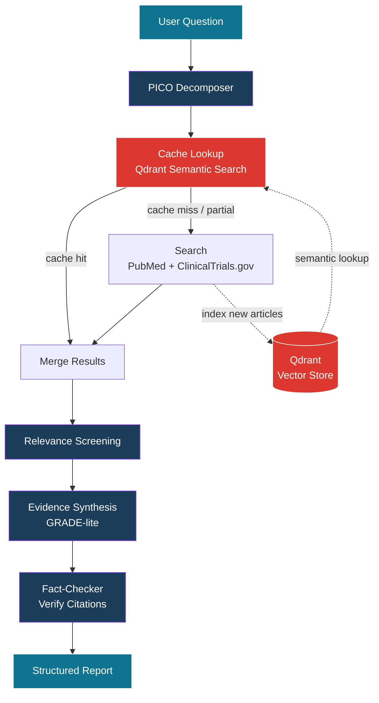

# Clinical Research Agent


A multi-agent system that answers clinical questions by searching PubMed, ClinicalTrials.gov, and FDA drug labels, then produces evidence-graded research summaries with verified citations.

> 🚧 Work in progress — building in public.

## Features

- 🧠 **Multi-agent pipeline** — PICO decomposition → search → screening → synthesis → fact-checking
- ⚡ **Semantic cache** — Qdrant vector store with freshness-aware retrieval; repeat queries skip external APIs
- 🔌 **Custom MCP server** — clinical tools usable from Claude Desktop, Cursor, or any MCP client
- ✅ **Citation verification** — deterministic checker catches hallucinated PMIDs and unsupported findings
- 📚 **Three data sources** — PubMed (E-utilities), ClinicalTrials.gov (API v2), openFDA drug labels

## Architecture



## Stack

| Layer | Technology |
|---|---|
| API | FastAPI (async) |
| Orchestration | LangGraph |
| LLM | Gemini 2.5 Flash via LiteLLM |
| Embeddings | `gemini-embedding-001` (768-dim) |
| Vector DB | Qdrant |
| Tool Protocol | Model Context Protocol (MCP) |
| Data Sources | PubMed E-utilities, ClinicalTrials.gov v2, openFDA |

## Endpoints

| Method | Path | Purpose |
|---|---|---|
| `POST` | `/research` | Full pipeline; returns PICO, report, factcheck |
| `GET` | `/library/search` | Semantic search over indexed articles |
| `GET` | `/library/stats` | Cache health stats |
| `GET` | `/health` | Liveness check |

## MCP Tools (standalone server)

| Tool | Description |
|---|---|
| `pubmed_search` | Search PubMed for biomedical literature |
| `trial_lookup` | Search ClinicalTrials.gov for trials |
| `drug_label_lookup` | FDA-approved drug label info via openFDA |

## Status

- [x] Data source clients (PubMed, ClinicalTrials.gov, openFDA)
- [x] Multi-agent orchestration with LangGraph
- [x] Citation fact-checker
- [x] MCP server
- [x] Qdrant semantic cache with TTL and similarity thresholds
- [ ] Langfuse tracing & evaluation harness
- [ ] Containerization & CI/CD
- [ ] Deployment & demo

## Quick start

```bash
# Setup
python3 -m venv .venv && source .venv/bin/activate
pip install -r requirements.txt
cp .env.example .env  # add your GEMINI_API_KEY

# Start Qdrant
docker run -d --name qdrant -p 6333:6333 \
  -v $(pwd)/qdrant_storage:/qdrant/storage qdrant/qdrant

# Run the API
python -m uvicorn app.main:app --reload

# Or run the MCP server standalone
python mcp_server.py
```
