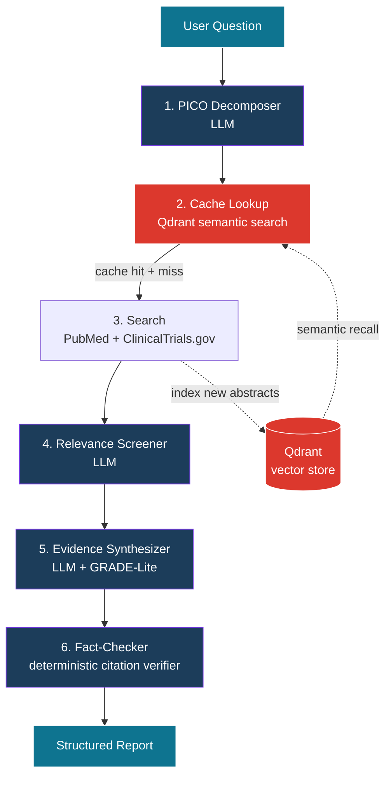

# 🩺 Clinical Research Agent

**Multi-agent evidence synthesis for clinical questions, with verified citations.**

Ask a clinical question → six specialized agents search PubMed, ClinicalTrials.gov, and the FDA, screen for relevance, synthesize a GRADE-graded evidence report, and verify every citation against retrieved sources.

[**Try it live →**](https://clinicalresearch.dtlabs.me)

---

## 📺 Demo

> _Demo video coming soon — see `docs/demo.gif` for a preview._

<!-- After recording: replace the line above with:

-->

---

## What it does

A clinical researcher asks: _"Are SGLT2 inhibitors effective for heart failure with preserved ejection fraction?"_

In ~20 seconds, the system returns:

- **PICO decomposition** of the question (Population, Intervention, Comparison, Outcome)
- **Live progress** as each agent runs — visible in the UI
- **An evidence summary** with GRADE-Lite quality rating and key findings
- **Inline citations** to PubMed (`[PMID:...]`) and ClinicalTrials.gov (`[NCT...]`), each click-throughs to the source
- **A fact-check banner**: every citation is verified against the actual retrieved sources — no hallucinated PMIDs
- **The full source list** with study type, status, and direct links

It's the difference between asking ChatGPT and asking a system designed for evidence synthesis: targeted authoritative sources, deterministic verification, full traceability.

---

## 🏗️ Architecture

**Six nodes, three LLM-based, three deterministic.** Verification, routing, and cache lookup don't need an LLM — using one would just add cost and a hallucination risk.

---

## 🎯 Key technical decisions

A few choices worth surfacing — these are what makes this system different from a typical RAG demo.

### 1. Deterministic citation fact-checker

LLMs hallucinate citations. The synthesis agent might cite `[PMID:99999999]` that doesn't exist in any of the retrieved abstracts. A separate deterministic node walks every citation and finding, verifies each reference maps to a real retrieved PMID/NCT, and flags unsupported claims. The frontend surfaces the result as a green or amber banner. **Trust is built in, not promised.**

### 2. Hybrid retrieval with semantic cache

Most RAG demos index a static corpus. Clinical literature is 35M+ papers — indexing all of it isn't practical. Instead:

- **Live retrieval** from PubMed + ClinicalTrials.gov on every query
- **Vector cache** of previously-seen abstracts in Qdrant (`gemini-embedding-001`, 768-dim cosine)
- **Cache-aside pattern**: a semantic search of past results runs _before_ external APIs are called. If similar abstracts exist (similarity ≥ 0.70) and are recent (< 30 days), they short-circuit the fetch. New articles are upserted on every miss.

Repeat queries on the same topic complete in ~7 seconds instead of ~20.

### 3. Live streaming UI via Server-Sent Events

A 20-second pipeline with no feedback feels broken. SSE pushes a structured event when each node starts and completes — duration, what it found, what it kept. The React UI renders six agent rows that light up in order, like watching a CI pipeline run.

### 4. Custom MCP server

The same clinical tools are exposed as a standalone Model Context Protocol server (`mcp_server.py`). Any MCP client — Claude Desktop, Cursor, Continue — can plug in and use `pubmed_search`, `trial_lookup`, and `drug_label_lookup` directly. Not just a tool _for_ an agent; a tool **shared with the broader agent ecosystem.**

### 5. Full observability via Langfuse

Every research run is one trace containing six nested spans. Each LLM call is captured as a generation with model, prompts, tokens, latency, cost. You can replay any past run and see what the agent decided at each step. Total cost per run: ~$0.002 with Gemini 2.5 Flash-Lite.

### 6. PII redaction at the boundary

Healthcare-adjacent context demands respect for PII. A FastAPI middleware redacts SSN, email, phone, MRN, DOB, and other patterns from request bodies _before_ they reach any agent. The redactor is a transparent regex layer; a production deployment would swap it for Microsoft Presidio.

---

## 🛠️ Stack

| Layer         | Technology                                                          |
| ------------- | ------------------------------------------------------------------- |
| Frontend      | React 19, TypeScript, Vite, Tailwind CSS v4                         |
| API           | FastAPI (async), SSE streaming                                      |
| Orchestration | LangGraph (state graph, 6 nodes)                                    |
| LLM           | Gemini 2.5 Flash via LiteLLM                                        |
| Embeddings    | `gemini-embedding-001` (768-dim)                                    |
| Vector DB     | Qdrant                                                              |
| Tool protocol | Model Context Protocol (MCP)                                        |
| Observability | Langfuse (self-hosted dev, cloud prod)                              |
| Data sources  | PubMed E-utilities, ClinicalTrials.gov v2, openFDA                  |
| CI/CD         | GitHub Actions (lint, test, Docker build, auto-deploy to Lightsail) |
| Deployment    | Docker Compose, Nginx (host + container), Cloudflare CDN            |
